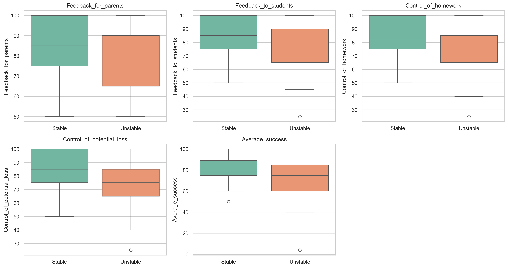
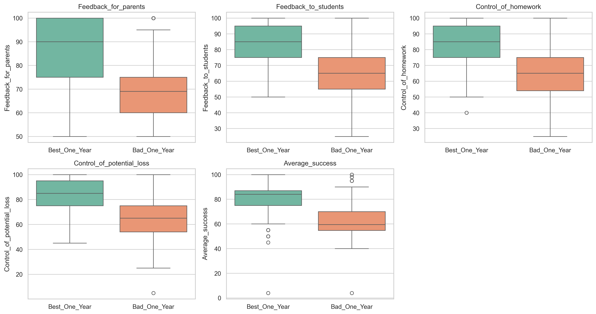
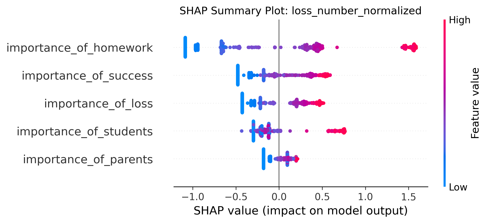
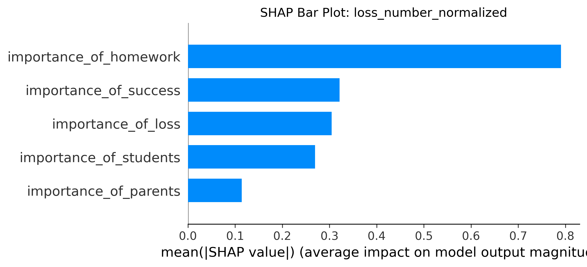
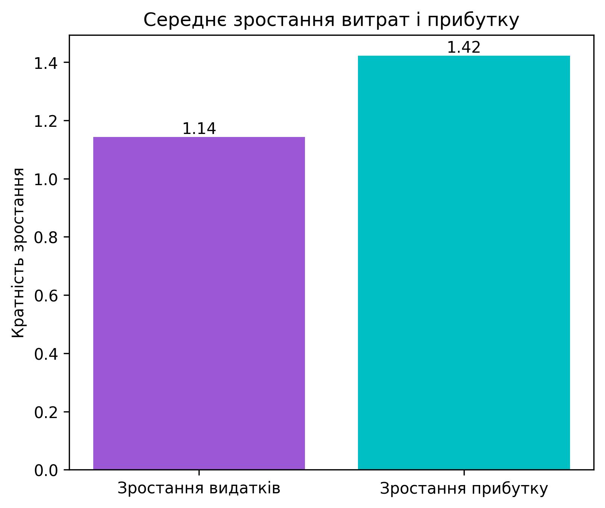

# Customer Churn Analysis & Retention Strategy
## 📊 Project Overview

### About the Company:  
**BrightMind School** is a fictionalized programming school (based on a real EdTech company I worked for).  The school provides coding education for children and teenagers, focusing on interactive classes and personalized mentorship. Classes at the school are held once a week. The academic year begins on August 1 and ends on July 31.

As a data analyst, I was responsible for tracking key metrics such as **reasons for students losing motivation**, **reasons for student dropout**, and **accordance of lesson structure with school standards**. Also, I developed strategies for working with teachers and searched for ways to improve the teaching process, provided personalized mentorship.

## 🎯 Goal

To identify the main key factor driving customer churn and to estimate the impact of improving teachers’ KPI performance (LKPI & BKPI) on reducing churn and increasing overall profitability.

## 🗝️ Key Steps (detailed above in "six key objectives" 🔝)

1) **Data Preprocessing**
2) **Feature Engineering**
3) **Statistical & Predictive Modeling**
4) **Visualization**
5) **Results & Reporting**

---

## 🛠️ Technologies Used

- **Python 3.12.1**
- **collections.Counter** – counting and aggregating elements in datasets
- **pandas**, **numpy** – data manipulation and feature engineering
- **seaborn** – statistical data visualization
- **scipy.stats** – statistical tests and analysis (Mann-Whitney U test)
- **statsmodels** – statistical analysis (Logit model)
- **scikit-learn** – machine learning (Random Forest Regressor & Classifier)
- **shap** – model explainability (SHAP summary plots)
- **matplotlib**, **seaborn** – data visualization
- **sqlite3** – database connection and querying
- **requests** – data fetching from APIs
- **re** – text processing and pattern matching
- **python-dotenv** – environment variable management
- **logging** – monitoring and debugging
- **os** – file system operations

---

## 📂 Project Structure
```
.
├── data/
│   ├── raw_students            # Raw datasets containing information about students who 
                                # dropped out
│   ├── teachers_data           # Original datasets with information on teachers and their 
                                # students, reporting overall student count and the number
                                # of dropouts
│   ├── financial_report        # Financial results report of the company
│   ├── teacher_kpi_records     # Two-year record of teachers’ monthly KPI performance, 
                                # monthly student dropouts, and awarded bonuses
│   ├── teacher_categories      # Analytical datasets categorizing teachers by student 
                                # dropout counts
│   ├── dropout_reasons         # Datasets analyzing the reasons for student dropouts
│   └── financial_results/      # Processed CSV files containing the project’s financial 
                                # results and calculations
│   ├── results_mannwhitney/    # CSV files with teachers categorized by student dropout 
                                # rates (Mann-Whitney analysis)
│   ├── results_of_modeling/    # CSV files containing outputs of statistical and predictive 
                                # models
│   └── results_RandomForest/   # CSV files containing outputs of Random Forest predictive
                                # models
├── docs/                       # Markdown files documenting analysis results and model 
                                # descriptions
├── images/
│   ├── financial_plots/            # Visualizations of the project’s financial results
│   ├── plots_RandomForest/         # Plots illustrating predictions, feature importance,
                                    # and KPI impact from Random Forest models
│   ├── teacher_category_comparison # Plots comparing teacher categories based on student
                                    # dropout rates
│   └── dropout_reasons_by_age      # Plots showing the top-3 reasons for student dropouts
                                    # by age group
├── src/
│   ├── data_analysis/
│   │   ├── feature_engineering.py         # Automation of teacher activity analysis from CSV and 
                                           # SQLite data
│   │   ├── random_forest_shap_analysis.py # Random Forest analysis of teacher KPI performance 
                                           # effect on yearly student churn, interpreted with SHAP
│   │   └── time_series_analysis.py        # Time series analysis of teachers’ educational and
                                           # business KPIs, with category comparisons
│   ├── data_modeling/
│   │   ├── assessment_of_causal_effect_bonusV1.py  # Logistic regression analysis of Bonus_v1 
                                                    # effect on teachers’ KPI performance
│   │   ├── assessment_of_causal_effect_loss_num.py # Logistic regression analysis of how increased
                                                    # KPI targets impact student dropout rates
│   │   └── data_modeling.py                        # Full-cycle teacher data analysis, motivation
                                                    # coefficient calculation, bonus modeling, and 
                                                    # KPI target prediction via Random Forest 
                                                    # Classifier
│   ├── ETL/
│   │   ├── etl/                        # Describes the Extract–Transform–Load (ETL) process used to
                                        # prepare data for analysis
│   │   ├── data_extraction.py          # Extraction and merging of data from a local SQLite 
                                        # database for subsequent CSV analysis
│   │   ├── data_preparation.py         # Augment main dataset with course prices, teacher
                                        # salaries, and financial losses per lost student
│   │   ├── DBLostClients.py            # ETL module for processing students who discontinued 
                                        # studies Jan 2022–Jul 2024
│   │   └── loss_students_data_pipeline.py # Prepare CSVs: extract group/student IDs, compute 
                                           # attendance, enrich with dropout reasons/age
│   └── financial_analysis/
│       ├── financial_losses.py         # Analysis of teacher/school losses, calculation of 
                                        # potential revenue and loss %, visualized with pie charts
│       └── financial_result.py         # Assess financial impact of "Bonus_v1" system reducing 
                                        # churn by 2.47x (Logit model), visualize results
└── README.md                           # This file

```
---

## 📈 Key Results
**table 1 "Mann–Whitney U test - Сomparison of teacher categories Stable vs Unstable"**
| Metrics                   | U-статистика | p-value | Significance | Insight |
|---------------------------|--------------|---------|------------|--------|
| Feedback_for_parents      | 9952.0       | 0.0004  | ✅ Yes      | Stable teachers communicate more systematically with parents. |
| Feedback_to_students      | 9657.0       | 0.0024  | ✅ Yes      | The best quality and regularity of feedback for students comes from Stable teachers.|
| Control_of_homework       | 9936.0       | 0.0005  | ✅ Yes      |Stable teachers better monitor the implementation of Home Assignments. |
| Control_of_potential_loss | 10779.5      | <0.0001 | ✅ Yes      | The strongest difference: stable ones react faster to the risk of loss. |
| Average_success           | 10258.5      | 0.0001  | ✅ Yes      | Students with stable teachers perform better.

**Conclusion 1:**
All metrics have statistically significant differences. **Stable teachers demonstrate higher quality of work**, which is manifested in better communication, control of the educational process and increased student results. 

**table 2 "Mann–Whitney U test - Сomparison of Best_One_Year and Bad_One_Year teacher categories"**
| Metrics                   | U-статистика | p-value | Significance | Insight |
|---------------------------|--------------|---------|------------|--------|
| Feedback_for_parents      | 33513.0      | <0.0001 | ✅ Yes      | The best teachers of the year provide significantly more quality feedback to parents. |
| Feedback_to_students      | 32650.0      | <0.0001 | ✅ Yes      | Students receive more systematic and valuable feedback from the best teachers. |
| Control_of_homework       | 32459.0      | <0.0001 | ✅ Yes      | Significantly better control over homework from the best teachers.|
| Control_of_potential_loss | 31926.5      | <0.0001 | ✅ Yes      | A Critical Difference: Top Teachers Respond Early to Risk of Attrition. |
| Average_success           | 34139.5      | <0.0001 | ✅ Yes      | Student results are noticeably higher among the best teachers. |

**Conclusion 2:**
By all indicators, **"Best_One_Year" teachers significantly outperform "Bad_One_Year"**.
The main difference is in the quality of communication, control, and proactive work with risks, which is directly reflected in student success.

**table 3 "RandomForestRegressor model results"**
| Metric                     | Value |
|---------------------------|------:|
| **Target**           | student_loss_number |
| **R2**               | 0.999  |
| **MAE**              | 0.031  |
| **RMSE**             | 0.057 |

**Conclusion 3:**
The coefficient of determination is almost 1, indicating an extremely high accuracy of the model. This means that the model explains 99.9% of the variation in the target variable - student number of loss.
The average absolute error is only 0.031. This means that on average the model forecast deviates from the actual values ​​by 3.1% (if we imagine that the target is expressed in percentages).
The root mean square error is 0.057. Since RMSE is more sensitive to large deviations, this low result shows that the model is not only consistently accurate, but also almost completely free of large errors.
✅ Taken together, these values ​​indicate that the constructed model has high predictive ability and can be used to interpret the importance of KPI contributions to the probability of student dropout.

**table 4 "Interpretation of results through SHAP-values"**
| Feature                     | Mean_SHAP_Abs |
|---------------------------|------:|
| **importance_of_homework**    | 0.79052 |
| **importance_of_success**     | 0.321124 |
| **importance_of_loss**        | 0.304658 |
| **importance_of_students**    | 0.269554 |
| **importance_of_parents**     | 0.114054 |

**Conclusion 4:**
The most important KPI for predicting dropouts is homework checking. Other factors—student performance, monitoring potential dropouts, and feedback to students—have significant but smaller impacts. Communication with parents makes the weakest contribution to the model.

**table 5 "RandomForestClassifier model results: Impact of Bonus Systems on Teachers' Motivation to Achieve KPIs"**

| Class           | precision | recall | f1-score | support |
|-----------------|-----------|--------|----------|---------|
| **Class 0**      | 0.824     | 0.848  | 0.836    | 99 |
| **Class 1**      | 0.571     | 0.526  | 0.548    | 38 |
| **accuracy**    | 0.759     | —      | —        | 137 |
| **macro avg**   | 0.697     | 0.687  | 0.692    | 137 |
| **weighted avg**| 0.754     | 0.759  | 0.756    | 137 |
| **ROC AUC**     | 0.819     | —      | —        | — |

**Conclusion 5:**
The model shows good overall performance with accuracy of ≈76% and high ROC AUC, but the classification of the smaller class needs improvement. Possible improvement strategies include  additional hyperparameter tuning.

**table 6 "Feature Importance**:

| Feature        | Importance |
|---------------|------------|
| **Bonus_v1**  | 0.709      |
| **Bonus**     | 0.146      |
| **Bonus_v2**  | 0.145      |

**Conclusion 6:**
Bonus_v1 (≈71%) – the most influential feature, driving the majority of predictions.
Bonus and Bonus_v2 (≈14–15% each) – less impactful but still important, helping refine classification when Bonus_v1 alone is not decisive.
Overall, the model relies primarily on Bonus_v1, with Bonus and Bonus_v2 serving as supporting features to improve prediction accuracy.

***table 7 - Logistic Regression results (Impact of Bonus_v1 application on the percentage of KPI fulfillment by teachers):**

| Metrics                     | Values |
|------------------------------|----------|
| **ATE (logit)**               | **1.344** |
| **Odds Ratio (OR)**           | **3.83** |
| **p₀ (without target raise)** | **0.095 (9.5%)** |
| **p₁ (with target raise)**    | **0.287 (28.7%)** |
| **Absolute Loss Decrease**    | **19.2%** |

**Conclusion 7:**  
The bonus system **Bonus_v1** has a statistically significant and practically important positive effect. It significantly increases the chances of teachers to achieve both **Learning KPIs** and **Business KPIs**, which makes it an effective tool for staff motivation. Therefore, if the Bonus_v1 bonus system is implemented, the performance of KPI indicators will also increase (as the model RandomForestClassifier showed).

**table 8 - Logistic Regression results (Impact of KPI improvement on student churn):**

| Metric                     | Value |
|---------------------------|------:|
| **ATE (logit)**           | 0.905 |
| **Odds Ratio**            | 2.47  |
| **p₀ (without target raise)** | 0.370 |
| **p₁ (with target raise)**    | 0.592 |
| **Absolute Loss Decrease** | **22.2%** |

**Conclusion 9:**  
> Implementing a target-raising bonus system for teachers is estimated to **reduce client churn by 2.47x** and increase retention probability by **≈22.2%**.

---

## 📊 Visualizations
| Comparison category 1 (Teachers & KPI) | Comparison category 2 (Teachers & KPI) |        
|----------------------------------|---------------------------|
|  |  |

|SHAP-summary (KPI & Losses)  | Bar Chart (KPI & SHAP-values) |
|----------------------------------|---------------------------|
|  |  |

| Scatter Plot (Profit vs. Expenses) | Bar Chart (Average Growth) |
|----------------------------------|---------------------------|
|  |  |

---
## 💡 Insights & Future Work  

- **Key Insights:**  
  - Implementing the **Bonus_v1 incentive system** can increase teacher KPI performance by **3.83×**  
    *(Logit model, `assessment_of_causal_effect_bonusV1.py`)*.  
  - Improved KPI performance is associated with a **2.47× decrease in student churn**  
    *(Logit model, `assessment_of_causal_effect_loss_num.py`)*.  

- **Next Steps:**  
  - 🧑‍🏫 **Roll out Bonus_v1** across all teachers to boost both Business KPI and Learning KPI.  
  - 💰 Explore **additional teacher motivation tools** to maximize revenue growth.  
  - 🧪 Test additional control variables (e.g., teacher engagement, different ages students behavior, difference of teachers by subjects and regions).  
  - 🤖 Compare logistic regression results with ML models (e.g., `RandomForestClassifier`) to further improve prediction accuracy.  
  - 🔄 Automate monthly reporting with a pipeline for continuous monitoring.  

---

## How to Run the Project

Run the full analysis pipeline starting from:

```bash
python src/ETL/loss_students_data_pipeline.py 
```

## 📂 Project Flow

1. ETL/ 
`loss_students_data_pipeline.py` → `DBLostClients.py`  → `data_extraction.py` → `data_preparation.py` → `etl_pipeline/main.py`
2. financial_analysis/`financial_losses.py`  
3. data_analysis/
`feature_engineering.py` → `time_series_analysis.py` → `random_forest_shap_analysis.py` 
4. data_modeling/
`data_modeling.py` → `assessment_of_causal_effect_bonusV1` → `assessment_of_causal_effect_loss_num.py`
5. financial_analysis/`financial_result.py`

## 👩‍💻 Author

**Olga Glubokaya**  
Data Analyst & Aspiring Data Scientist  
- 📧 [olga.glubokaya.ds@gmail.com]  
- 💼 [LinkedIn](https://www.linkedin.com/in/olga-glubokaya-314991265/) 

---

## ⚠️ Disclaimer

This project uses **anonymized and modified educational data** from a real EdTech company.  
Company name and sensitive metrics were changed for confidentiality purposes.

