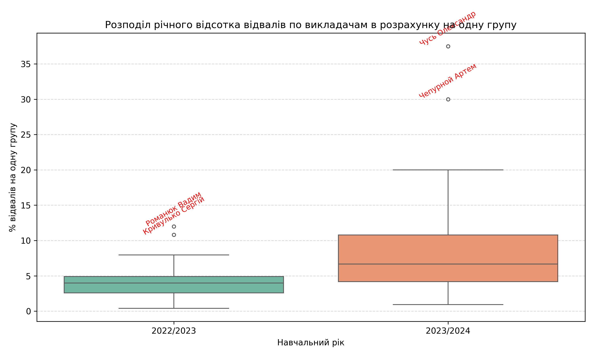
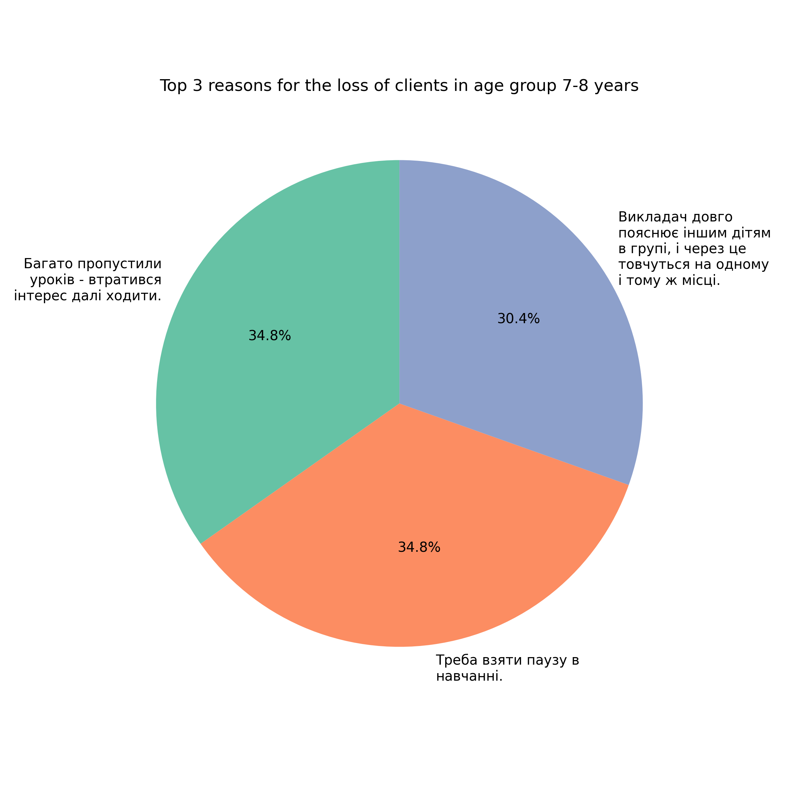
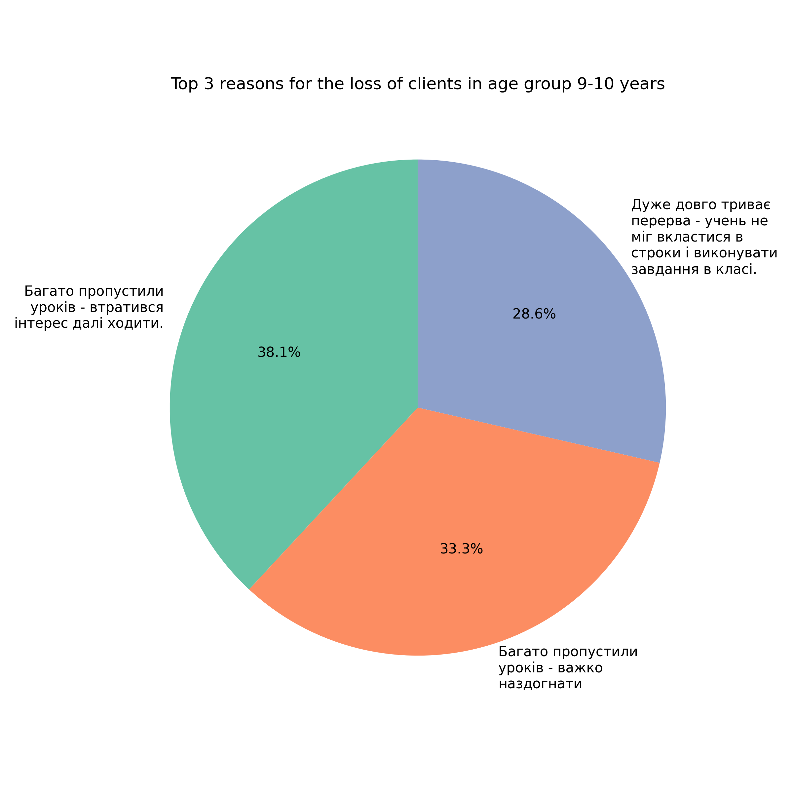
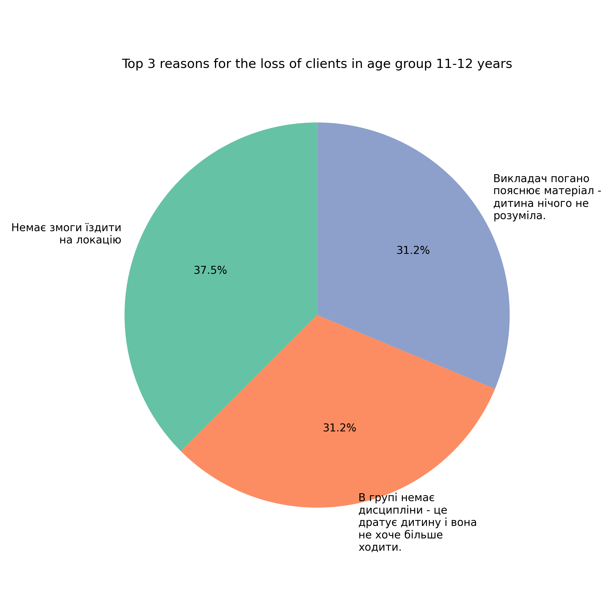
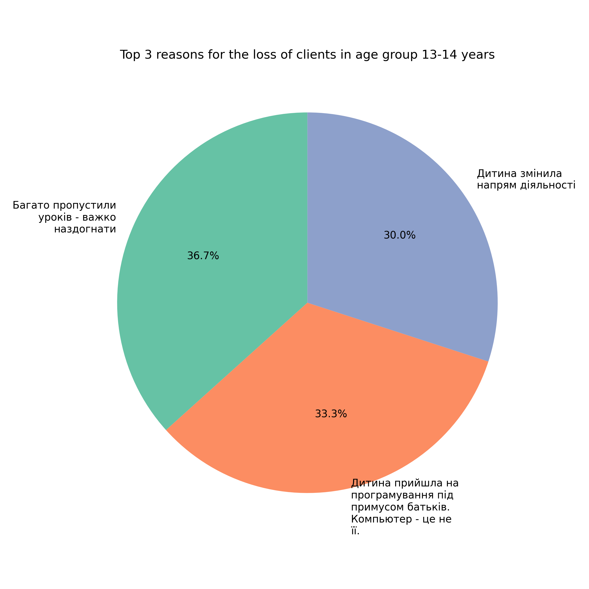

# 📂 ETL Pipeline Documentation

Цей документ описує процес **Extract – Transform – Load (ETL)**, що використовується для підготовки даних перед аналізом у цьому проєкті.  

---

## 🔹 1. Extract (Отримання даних)

Джерела даних:  
- SQL-база компанії (таблиці з інформацією про студентів, які припинили навчання в школі):
    - Gone_Clients.sqlite.  
- CSV-файли з додатковими даними:
    - Raw_data.csv - датасет з датой припинення навчання, ПІБ і ID групи;
    - Lost_reasons.csv - датасет з причинами припинення навчання і віком дитини;
    - Extended_raw_data.csv - датасет містить інформацію про предмет, який вивчала дитина; 
    - costs_salaries_converted.csv - датасет з фінансовими даними стосовно вартості курсу для клієнтів, ставки викладача і загальних витрат компанії;   
- API зовнішнього сервіса школи learning management system:
    - https://lms.logikaschool.com/api/.  

Скрипти в лінійному порядку:  
1. `loss_students_data_pipeline.py` -
    - отримання датафрейму з вхідних даних;
    - створення нової назви серії;
    - отримання ID студентів через зовнішній API (ключи в .env);
    - отримання кількості відваних уроків для кожного відвала по ID групи і ID студента;
    - підготовка даних для подальшої деталізації - створення серій по вертикалі "Причина відвала" і "Вік дитини";
2. `DBLostClients.py` —  
    - створення бази даних;
    - створення таблиць з PK;
    - створення зв'язаної таблиці з FK;
    - завантаження даних з датафрейму в SQLite;
3. `data_extraction.py` —  
    - вивантаження усіх табліць в один файл .csv для подальшого аналізу даних

Результат:  
Отримали наступні датасети:
- 1_Attended_classes.csv - додано поля "ID студента" і "Кількість відвіданих занять"
- FinalFinal_Gone_Clients_Report.csv - додано поля "attendance_number" і "lost_reasons"
---

## 🔹 2. Transform (Обробка даних)

Основні кроки:  
- стандартизація дат у формат `YYYY-MM-DD`;  
- нормалізація прізвищ і імен викладачів; 
- feature engineering - додавання нових полей зі значеннями фінансових втрат від відвалів для викладачів і компанії окремо;
- категоризація віку студентів;
- фільтрація основного датасету;
- збереження очищених даних;
- візуалізація і квартільний аналіз даних;
   
Скрипти в лінійному порядку:  
1. `data_preparation.py` —   
    - додавання колонок в основний датасет з вартістю курсів і зарплатами викладачів;
    - перетворення дат у формат datetime з перевіркою на валідність;
    - створення додаткових полей "teacher_lost" і "school_lost";

2. `etl_pipeline/main.py` —   
    - нормалізація та виправлення прізвищ та імен викладачів;
    - контроль перетворення дату формат datetime;
    - створення чотирьох категорій віку студентів;
    - фільтрація основного датасету за навчальні роки (2022–2023 та 2023–2024);
    - збереження очищених даних для подальшої обробки;
    - формування статистики по викладачах за два навчальні роки;
    - візуалізація відвалів на одну групу і топ-3 причин відвалу по вікових групах;
    - квартильний аналіз викладачів по показнику річного відсотока відвалів вкладача;
    - вивід результатів у CSV та графічні файли.

## Графіки:
## 1. Boxplot розподілу відсотка втрат студентів викладачами



## Висновок:
На графіку показано порівняння розподілу річного відсотка відвалів студентів по викладачах у 2022/2023 та 2023/2024 навчальних роках.

Спостереження:
Було отримано два "ящика з вусами" за два навчальних роки: 2022/2023 та 2023/2024.

Підсумок по першому ящику за 2022/2023 рік:
- більша частина викладачів з міжквартільної зони мали відсоток відвалів меньший медіанного значення, тобто в більшості викладачи гарно виконували свої обов'язки, що свідчить про їх спроможність втримувати клієнта;
- є найкращі викладачи, які мали мінімальний відсоток відвалів (< 2.8), а також гірші, хто мав 
відсоток відвалів > 6,5% ;
- також є викиди - викладачи, яки мали великий відсоток відвалів близько 11%–12%, що вимагає детального аналізу;
- У 2022/2023 році медіана відсотка відвалів була нижчою (≈4%), розкид значень невеликий. Це свідчить про те, що вівдалів у викладачів було значно меньше, ніж в наступному році, і кількість відвалів у всіх викладачів була майже однакова, якщо дивитися на наступний бокс (різниця наочна).

Підсумок по другому ящику за 2023/2024 рік:
- більша частина викладачів з міжквартільної зони мали відсоток відвалів більший медіанного значення, це свідчить про те, що ситуація з відвалами погіршилась і більшість викладачів почала швидше втрачати клієнтів. Це свідчить про необхідність знайти тенденцію, чому так сталось по зрівнянню з минулим роком.
- нижня межа стала більше на 0,2% (від 2,8% до 3%)- це свідчить що найгарніші викладачі здають свої позиції і починають більше втрачати клієнтів, ніж в минулому році;
- верхня межа збільшилась на 5,5% (тобто з 6,5% до 12%) - це свідчить про те, що найгірші викладачі стали входити в норму в новому році, і це теж вимагає пошуку тенденції зростання відвалів у викладачів;
- також були помічені викиди, але з набагато більшим результатом відвалів, ніж в минулому році - з 11%-12% підвищились до більш ніж 30%;
- у 2023/2024 році медіана зросла (≈6–7%), а варіативність збільшилася — з’явилося більше викладачів із дуже високими відсотками відвалів.

Виявлені викиди:

2022/2023: Романюк Вадим, Кривулько Сергій.
2023/2024: Чусь Олександр, Чепурной Артем.

**Висновки**:

У другому році ситуація стала менш стабільною: хоча більшість викладачів мають відсотки в межах, але окремі показники зросли в рази. Це свідчить про те, що певна група викладачів суттєво впливає на загальну статистику, і саме вони потребують окремого аналізу причин відвалів.

## Таким чином, пропонується:
1) Зробити вибірку викладачів (окремо в кожному часовому періоді) з найкращими результатами, які входять в зону першого квартиля, найгірших викладачів - третій квартиль, викладачів в міжквартільної зоні і окремо проаналізувати викладачів, яки опинилися викидами з основної маси викладачів. 
2) По кожному досліджуваному викладачу провести аналіз ключових показників ефективності, прийнятих і затвердженних в компанії:

**Business KPI** -
- спілкування в чатах з батьками (рахується щомісячний відсоток);
- спілкування в групах з дітьми (рахується щомісячний відсоток);
- чи відстежує викладач потенційні відвали і чи вносить їх в звітність для тьютора з подальшим розбором ситуацій на щотижневих зідзвонах (рахується щомісячний відсоток);

**Learning KPI** - 
- середня успішність в групах у кожного викладача (у відсотках);
- контроль домашньої практики (рахується у відсотках).

## 2. Plot_pie Топ-3 причин відвалу по вікових групах A (7-8 років), B (9-10 років), C (11-12 років), D (13-14 років)



## Висновок:
На графіку видно три основні причини відвалу дітей 7-8 років які є в базі даних компанії за розглядаємий період з 01.01.2022 по 31.07.2024 рік. 
Спостереження:
З них до освітніх причин відноситься 35.1%, де викладач занадто жартівливо і розважально проводить заняття. Решта причин - це:
35.1 % - Треба взяти паузу в навчанні - тобто причина не визначена.
29.7 % - Багато гуртків і не вистачає часу на програмування.
Ці причини прямо не називають проблему, але свідчать одностайно про втрату мотивації дітей відвідувати заняття нашої школи.




## Висновок:
На графіку видно три основні причини відвалу дітей 9-10 років які є в базі даних компанії за розглядаємий період з 01.01.2022 по 31.07.2024 рік. 
Спостереження:
35.5% - Складні обставини в сім'ї.
32.3% - Багато пропустили уроків і втратили інтерес до навчання програмуванню.
32.3% - Багато пропустили уроків - важко наздогнати матеріал.
Ці причини прямо і косвенно свідчать про втрату мотивації ходити на навчання.



## Висновок:
На графіку видно три основні причини відвалу дітей 11-12 років які є в базі даних компанії за розглядаємий період з 01.01.2022 по 31.07.2024 рік. 
Спостереження:
42.3% - Немає змоги їздити на локацію.
30.8% - Дитина прийшла на програмування під примусом батьків. Компьютер - це не її.
26.9% - Викладач погано пояснює матеріал - дитина нічого не розуміла.
Остання причина - пряма освітня, решта опосередковано свідчать про втрату мотивації ходити на навчання програмуванню в нашій школі.



## Висновок:
На графіку видно три основні причини відвалу дітей 11-12 років які є в базі даних компанії за розглядаємий період з 01.01.2022 по 31.07.2024 рік. 
Спостереження:
33.3% - Дитина змінила напрям діяльності.
38.9% - Дитина прийшла на програмування під примусом батьків. Компьютер - це не її.
27.6% - Сумнів навчатися саме в нашій школі.
Усі причини опосередковано свідчать про втрату мотивації ходити на навчання програмування в нашу школу.

## Підсумок: 
Серед усіх вказаних причин є дві освітні, які свідчать про неякісність пояснення матеріалу з боку викладача і про зайву жартівливість під час уроків. Вони вимагають аналізу методичних консультацій, що проводять керівники викладачів, а також призначенню додаткового навчання викладачів. А решта десять причин свідчать про втрату мотивації до навчання в нашій школі програмування. Вони вимагають аналізу освітніх матеріалів з одного боку (тобто завдань і методик вивчання програмування на усіх курсах школи). 
Також важливо провести аналіз дотримання показників якості викладання, які прийнято в компанії-власниці школи. До них відносяться Business KPI і Learning KPI (детально вказані вище). Тому підтверджується пропозиція:
1) зробити вибірку викладачів (окремо в кожному часовому періоді) з найкращими результатами, які входять в зону першого квартиля, міжквартільну зону, найгірших викладачів - третій квартиль, і окремо проаналізувати викладачів, яки опинилися викидами з основної маси викладачів. 
2) По кожному досліджуваному викладачу провести аналіз ключових показників ефективності, прийнятих і затвердженних в компанії.

## Результат:  
1. Категоризація викладачів по квартильному аналізу показника "річний відсоток відвалів вкладача в розрахунку на одну його групу";
2. Категоризація викладачів по признаку стабільності роботи в школі:
    - працюють один рік;
    - працюють два роки;
    - якщо працюють два роки, чи потрапляли в одну у ту саму виборку кожного року, чи ні;
3.  ### Інсайт по причинам відвалів: 
Необхідно провести аналіз роботи викладачів по прийнятим в компанії Business KPI і Learning KPI за два навчальних роки:
    - з 01.08.2022 по 31.07.2023;
    - з 01.08.2023 по 31.07.2024.

---

## 🔹 3. Load (Завантаження даних)

Фінальні дані зберігаються у форматі:  
- `data/General_Gone_Clients_Report.csv` - готовий датасет з даними по студентам-відвалам для подальшого аналізу та моделювання.
- `data/teachers_analysis.csv` - готовий датасет з даними по викладачам для подальшого аналізу та моделювання.
---

## 🔹 5. Як запустити ETL

```bash
# 1. Отримати дані
python src/ETL/data_extraction.py

# 2. Обробити і Завантажити фінальний датасет
python -m src.ETL.etl_pipeline.main

