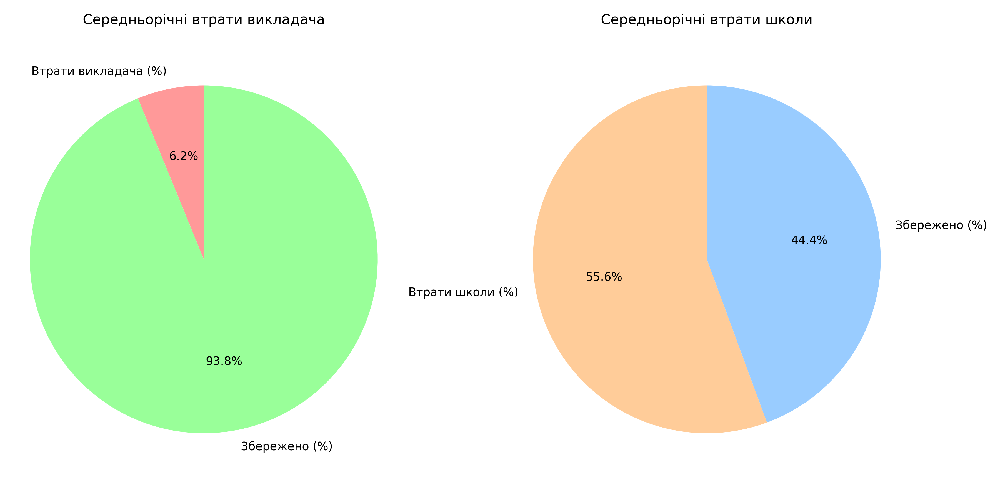
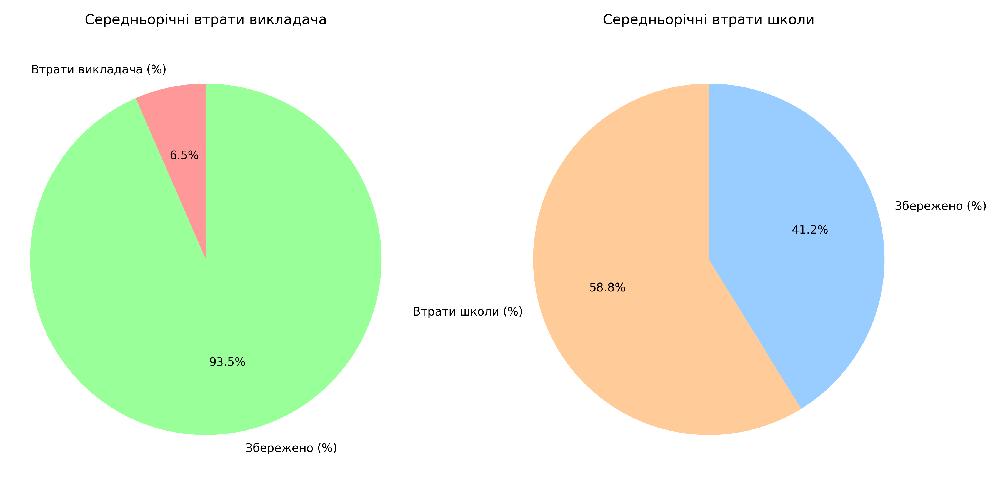

# Фінансовий аналіз втрат викладачів і школи

## Мета модуля

Модуль **`financial_losses.py`** виконує комплексний аналіз фінансових
втрат викладачів та компанії, пов'язаних із відвалами студентів.
Результати аналізу дають змогу оцінити, **наскільки ефективно школа та
викладачі зберігають свої потенційні доходи**, і слугують відправною
точкою для формування гіпотез щодо зменшення втрат та подальшого
підвищення прибутковості.

------------------------------------------------------------------------

## Основні завдання

1.  **Збір та фільтрація даних**
    -   Завантаження інформації про групи, зарплати викладачів та
        відвали з основного датасету\
    -   Фільтрація по обраному навчальному року (початок і кінець
        періоду).
2.  **Розрахунок ключових фінансових показників**
    -   Середнє значення та стандартне відхилення втрат викладачів і
        школи.\
    -   Середню зарплату викладача.\
    -   Кількість груп та середню вартість навчання на місяць.\
    -   Максимально можливий річний дохід викладачів і школи.\
    -   Відсоток втрат викладачів та школи від максимально можливого
        доходу.
3.  **Збереження результатів**
    -   Фінансові показники для кожного навчального року зберігаються у
        CSV-форматі:
        -   `data/financial_results/financial_analysis_2022_2023.csv`\
        -   `data/financial_results/financial_analysis_2023_2024.csv`
4.  **Візуалізація втрат**
    -   Побудова кругових діаграм (pie charts), які відображають частку
        втрат та збереженого доходу.\
    -   Кожен рік аналізується окремо, результати зберігаються у форматі
        PNG:
        -   `images/financial_plots/loss_pie_chart_2022_2023.png`\
        -   `images/financial_plots/loss_pie_chart_2023_2024.png`

------------------------------------------------------------------------

## 5. Візуалізації

Кругова діаграма показує відсоток втрат викладача і відсоток втрат компанії **ЗА 2022 -- 2023 НАВЧАЛЬНИЙ РІК**:  

Кругова діаграма показує відсоток втрат викладача і відсоток втрат компанії **ЗА 2023 -- 2024 НАВЧАЛЬНИЙ РІК**:

## 6. Висновки
  ---------------------------------------------------------------------------------------

-   **Зліва** -- втрати викладача (у % від максимально можливого річного
    доходу).\
-   **Справа** -- втрати школи (у % від потенційного річного прибутку).\
-   Червоний та помаранчевий сегменти показують втрати, зелений і
    блакитний --- збережені кошти.

Відсоток втрат викладача - 6,2% і 6,5%
Відсоток втрат компанії - 55,6% і 58,8%
**Відсоток втрат викладача майже в 9 разів меньш ніж відсоток втрат компанії!**
Це - ключовий момент для того, щоб знайти можливості усунення відвалів, через які компанія втрачає більше половини власного доходу. Ситуація наводить на думку, що викладачу не так сильно "бьє по кишені" втрати від відвалів, і вони не можуть бути зацікавлені у втриманні клієнтів на тому же рівні, як компанія. А попередній аналіз показав, що саме **від викладача** залежить мотивація студентів до навчання. Тобто ситуація коротко така:
- від виконання викладачами KPI залежить кількість їх відвалів;
- від компанії залежить зацікавленість викладачів виконувати встановлені KPI;

------------------------------------------------------------------------

## Значення для подальшого аналізу

Отримані показники є **базовими контрольними точками** (baseline) для
майбутнього моделювання за допомогою методів машинного навчання.\
Вони дозволяють:\
- Порівнювати фінансову ефективність різних періодів.\
- Виявляти викладачів та групи з найбільшими відхиленнями від середніх
показників.\
- Формувати гіпотези для зменшення втрат і прогнозувати фінансовий ефект
від змін.

Таким чином, цей модуль є **ключовим етапом підготовки даних** перед
побудовою моделей та тестуванням гіпотез у наступних кроках
аналітичного пайплайну.

## Рекомендації до наступних кроків

 - необхідно проаналізувати існуючу Performance-based compensation system - тобто систему стимулювання і мотивації викладачів, наскільки вона працює і заохочує викладачів до виконання показників ефективності Business KPI i Learning KPI;
 - запропонувати нові моделі систем мотивації викладачів;
 - перевірити їх ефективність на основі алгоритмів машинного навчання, а саме прогностичних і причинно-наслідкових регресій;
 - довести фінансово ефективність запропонованих Performance-based compensation systems для викладачів, обрати найкращу систему і порахувати коефіціент зростання прибутку як результат застосування запропонованої системи стимулювання викладачів.